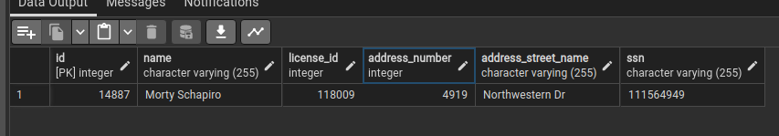
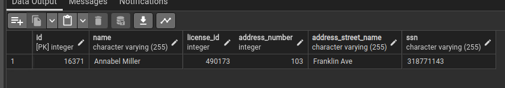
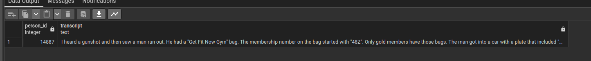
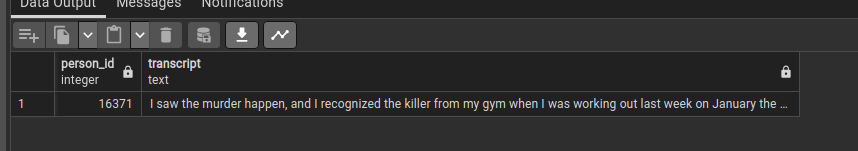
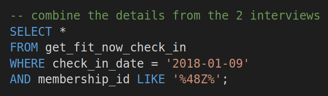
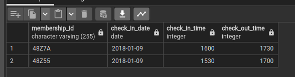
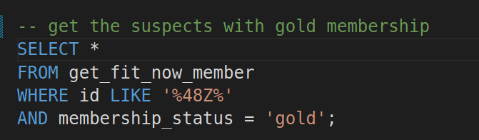
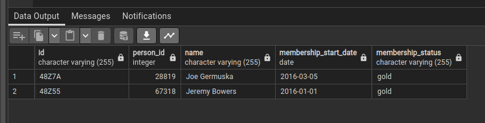
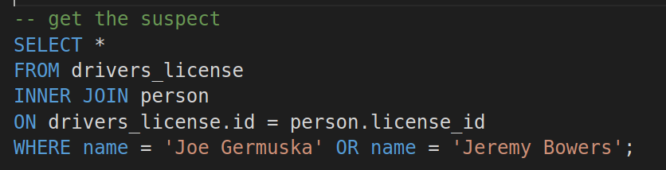
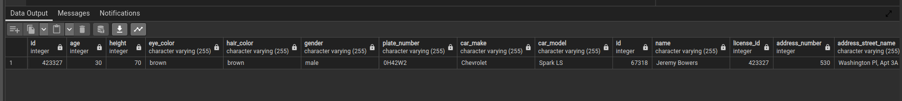

# SQL Murder Mystery Challenge

## Get details from crime scene report table

### output

## Get details of the person leaving in the last house on the street

### output

## Get Annabel details who lives around Franklin Ave

### output

## Get details from the interview table

### output

### output

## Combine details from the 2 interviews

### output

## Get suspects with gold membership

### output

## Join the tables to get the final suspect

### output

