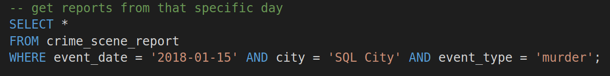

# SQL Murder Mystery Challenge

## Get details from crime scene report table

### output

## Get details of the person leaving in the last house on the street

## Get Annabel details who lives around Franklin Ave

## Get details from the interview table

